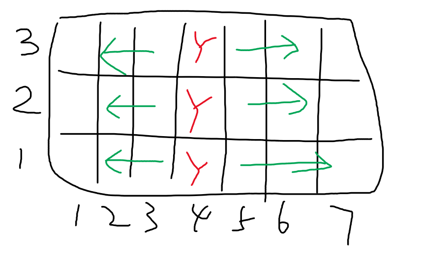

碰到这种题目，把 Queries 反转，从后往前解决是一个很正常的想法。 

因为对于每个白纸的格子，我们只关心最后一次染色的颜色，所以之前染过的颜色是都不用考虑的。而把 Queries 反转后进行染色，白纸某个位置第 1 次被染的颜色，等同于按照原来顺序染色的最后一个颜色。 

我们每次 Queries 都染出一种新颜色，并且有 k 种颜色可以染色，所以白纸的可能性需要比原来的状况多 k 倍。 
``` 
ans = ans * k
``` 

那么 我们什么时候不能染色呢？
- 在从后往前处理的过程中，如果一个位置已经被染过色了，那么我们可以直接忽略 
- 如果整个白纸都被染满颜色，直接退出。 

如何判断整个白纸是否都被染色呢，实际上只要判断在横轴/纵轴上染色的总数量低于横轴个数和纵轴个数即可。

举例子



此时纵轴的上染色的总数量是 3，就是画的三个 Y。
然而因为我们都是给 X 和 Y 一起染色，所以只要这三个格子染色，
所有 Y 标记的左侧和右侧都会被染色，所以整个白纸都被染色了


```
typedef long long ll;
#include <bits/stdc++.h>

using namespace std;

#define rep(i, a, b) for (int i = (a); i < (b); i++)
#define all(cont) cont.begin(), cont.end()
#define ms(a) memset(a, 0, sizeof(a))
#define EPS 1e-9
	
template <class T> void oa(const vector<T>& a) { for (int i = 0; i < a.size(); ++i) cout << a[i] << " \n"[i + 1 == a.size()]; }
typedef long long ll;
ll MOD = 998244353;

void add(ll &x, ll a) {
	x += a;
	if (x >= MOD) x -= MOD;
}
void sub(ll& x, ll a) {
	x = ((x - a) % MOD + MOD) % MOD;
}


void solve() {
	ll n, m, k, q;
	cin >> n >> m >> k >> q;
	int rows[n];
	int cols[m];
	ms(rows); ms(cols);
	vector<array<int, 2>> queries(q);
	rep (i, 0, q) {
		cin >> queries[i][0] >> queries[i][1];
		queries[i][0]--; queries[i][1]--;
	}
	reverse(all(queries));
	int cntx = 0, cnty = 0;
	ll ans = 1;
	for (auto& [x, y] : queries) {
		if (rows[x] != 0 && cols[y] != 0) continue;
		if (cntx == n || cnty == m) break;
		ans = 1LL * ans * k % MOD;
		if (!rows[x]) {
			rows[x] = 1;
			cntx++;
		}
		if (!cols[y]) {
			cols[y] = 1;
			cnty++;
		}
	}
	cout << ans << endl;
}


	
int main() {
	ios_base::sync_with_stdio(0);
	cin.tie(nullptr);
	
	int q;
	cin >> q;
	while (q--)
		solve();
	
	
}

// FAST CP: D:\Codes\problem-goods\playground
```