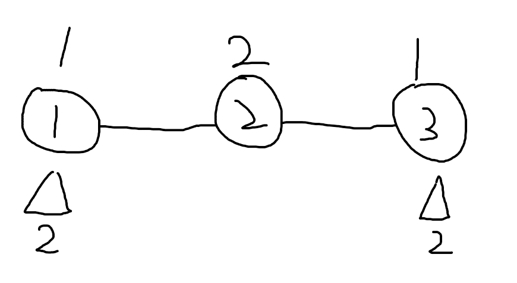
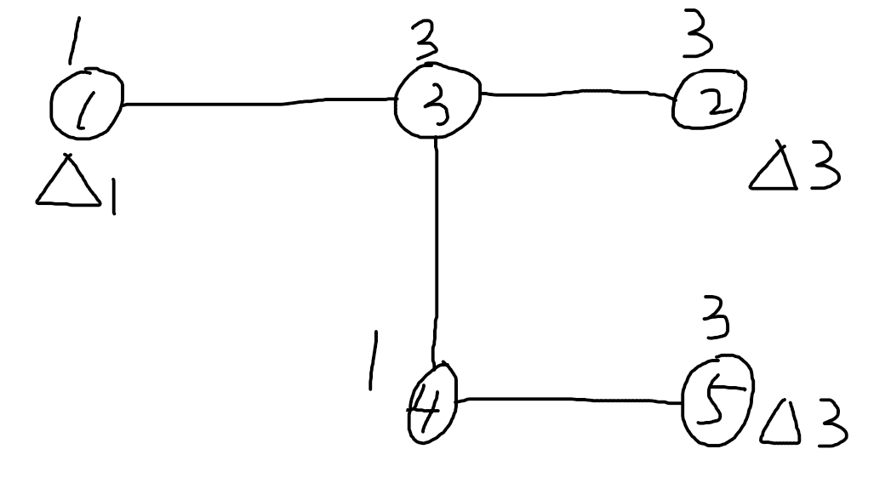
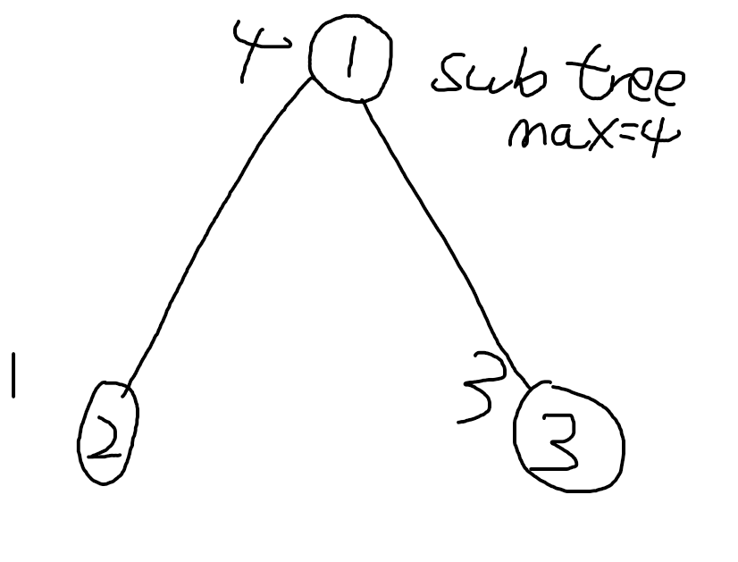
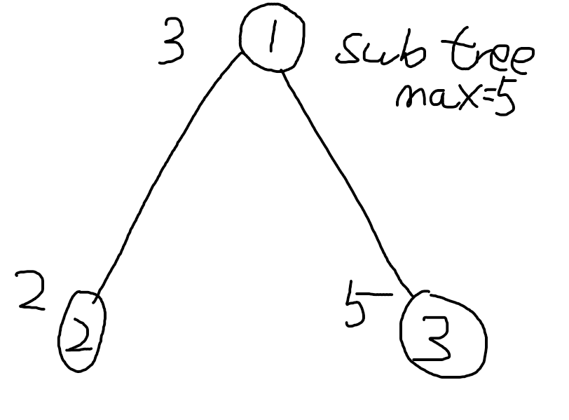

这道题其实是一个非常好的题，看了一下官方的题解，感觉确实是不是那么很容易想。然后又看了一下 SecondThread，整个思维流程都很清晰。
所以实现了一个他版本的 CPP 代码。重新来复述一下这道题。 

---

首先我们要清楚题意，我们现在有一个图，这些图节点本身一个属性，叫做节点的高度，现在要在一些图节点上面安放信号塔（就是给节点个数值）。 

使得图中的每一个图节点，都处于某两个信号塔之间形成的路径上，并且节点的高度分别不高于两个信号塔的强度。 

我们先来看题中所给的前两个例子

例子 1

Note 说答案是在第 1 个节点和第 3 个节点处安放，强度为 2 的塔 

我们来看看，如果按照这样的策略符合条件吗？当然是符合条件的 
- 图中的节点 1， 1 到 3 之间有一条路径，节点的高度为 1 ，两座信号塔的强度为 2，`1 <= 2` 符合条件 
- 图中的节点 2， 1 到 3 之间有一条路径，节点的高度为 2 ，两座信号塔的强度为 2，`2 <= 2` 符合条件 
- 图中的节点 3， 1 到 3 之间有一条路径，节点的高度为 1 ，两座信号塔的强度为 2，`1 <= 2` 符合条件



例子 2



按照答案所给的策略，我们得到的结果是

- 图中的节点 1， 1 到 2 之间有一条路径，节点的高度为 1 ，两座信号塔的强度为 1 和 3，`1 <= 1` 符合条件 
- 图中的节点 2， 2 到 5 之间有一条路径，节点的高度为 3 ，两座信号塔的强度为 3，`3 <= 3` 符合条件 
- 图中的节点 3， 2 到 5 之间有一条路径，节点的高度为 3 ，两座信号塔的强度为 3，`3 <= 3` 符合条件 
- 图中的节点 4， 1 到 5 之间有一条路径，节点的高度为 1 ，两座信号塔的强度为 1 和 3，`1 <= 1` 符合条件 
- 图中的节点 5， 2 到 5 之间有一条路径，节点的高度为 3 ，两座信号塔的强度为 3，`3 <= 3` 符合条件 

我们很快就能发现，我们永远都是在叶子节点上建塔，如果我们不在叶子节点上面建造塔，那么就会出现这样的情况


我们会发现这上面的叶子节点，就再也没可能处于两座塔中间了, 这显然不符合题意

那么现在问题来了，如果我们要在每一座叶子节点上建造塔，其信号强度应该是多少？ 

我们虽然暂时还不知道，但是我们可以知道一件事，就是我们必须有两个叶子节点，
其上面的塔的信号强度值等于图中节点的高度的最大值。如果我们把所有塔建造完了，
信号强度都不能覆盖到图中那个值最高的节点，显然也是不符合题意的。

但是，我们既然知道了我们需要存在两个节点，也知道其信号强度需要达到最强，
但是我们有那么多的叶子节点，应该把这俩信号塔放在哪个叶子节点上啊？ 

我们知道，叶子节点很多，这种情况离不开对图的暴力搜索了。
我们从那个高度最高的节点开始，对于那个高度最高的节点来说，
他一定希望能够从一堆叶子节点中，找到两个叶子节点，安放信号最强的信号塔。

所以它实际上面临这两种选择 
- 从我开始，暴搜到某个叶子节点，最后那个叶子节点的信号塔不对我负责（也就是说，不需要那座信号塔的信号强度去达到最高，目的是覆盖我） 
- 从我开始，暴搜到某个叶子节点，最后那个叶子节点的信号塔对我负责（也就是说，一堆叶子节点选 2 个，这个叶子节点是其中之一） 
 
两种策略，选择最优，我们容易想到这是个树形 DP 问题，最后返回根节点就是答案。

然后此时我们再想一想，这个问题的子问题是什么？

我们这时再回来看图，实际上不仅仅针对那个高度最高的节点， 针对图中的每一个节点，我们其实都有
- 从我开始，暴搜到某个叶子节点，最后那个叶子节点的信号塔不对我负责（也就是说，不需要那座信号塔的信号强度达到我的高度） 
- 从我开始，暴搜到某个叶子节点，最后那个叶子节点的信号塔对我负责（也就是说，一堆叶子节点选 2 个，这个叶子节点是其中之一） 

说来说去，还是没说到如何把不同的信号塔放在哪个叶子节点上。但是也没有必要先着急，
一般情况下 DP 只关心最后的最优解的值，而不关心最优解 ”在哪“。

我们一般在写 DP 的时候，肯定是要借助数据本身的信息，来帮助我们作出最优决策。

我们先来看看这图中到底有啥信息 

节点 ID, 图节点的高度，没了。 

所以从图中的任何一个节点，向叶子节点去搜索，我们最后一定能够得到，针对每一个图节点，
这条路径中，所经过的最高的图节点高度。

但是这里有一个问题，在这种连通图上暴力搜索，那不实际上就是遍历整个图嘛？
所以到最后每个节点，因为把所有图结点都走完了，从其到叶子节点的路径中，所经过的最大的高度值都是一样的？ 

说得没错，所以在这里我们要自断后路，from->to，每走到一个 to 节点，
就断开和 from 的连接就可以了。 

所以在这里，针对图中的每一个图节点，我们只有两种可能 

1. 自己的高度，就是子树所有节点当中最高的了 

 

2. 自己不是子树所有节点当中最高的 

 

这个时候再来回看我们对 DP 时所作出的选择 

如果我作为爹，自己已经是子树节点中高度最大的了，那么针对我所有的孩子，
孩子们一定都是这么想的，我们有一个父亲，他的高度比我们都大。 

那 “从我开始，暴搜到某个叶子节点，最后那个叶子节点的信号塔对谁负责？信号强度是否覆盖我？” 的答案是 --- 

”必然是不覆盖我啊，那个叶子节点的塔信号强度，足够覆盖掉我父亲就可以了。“

儿子和父亲在一条路径上，我父亲高度比我大， 那我自身肯定是满足条件的

此时父亲开始需要为他的高度建造塔，通过排序，选择一个收益最大的孩子向下走，
然后一直走到叶子节点， 建造一个塔，塔的信号强度就是它自己的高度。

所以这就是我们为什么了有这一段代码 
``` 
sort(all(conn), Cmp());     // choose max profit children
if (height == subtreeMax) {
	// NEED TO PAY FOR MYSELF
	ans+=height;
	for (int i = 0; i < conn.size(); i++) {
		ans+=(i < 1 ? conn[i]->costCovered : conn[i]->costUncovered);
	}
}			
``` 

如果我自己是爹，不是子树节点中高度最大的，那就一定有一个孩子比我高度要高。 

那 “从我开始，暴搜到某个叶子节点，最后那个叶子节点的信号塔对谁负责？高度是否覆盖我？” 的答案是 ---

“不了，让我孩子来吧，儿子和父亲在一条路径上，我儿子都比我高，那我自身肯定是满足条件的。“

所以这就是我们为什么了有这一段代码 

```
for (int i=0; i < conn.size(); i++) {
    ans+=(i < 0 ? conn[i]->costCovered : conn[i]->costUncovered);	// uncovered
}
```

这就完事了吗？当然不是，此时我们看到的场景是什么？

<del>要不然我孩子牛逼把我包了，要不然我牛逼把孩子包了</del> 

那么有没有一种可能就是我的父节点把我包了呢？答案是肯定的。
但是同样，在选择依赖自己的父亲的同时，我们仍然通过排序，
选择一个收益最大的孩子向下走，然后一直走到叶子节点。

所以这就是为什么我们有了这段代码。
```
sort(all(conn), Cmp());
ll ans = 0;	// choose only one children then cover that children
for (int i = 0; i < conn.size(); i++) {
    ll toAdd = (i < 1 ? conn[i]->costCovered : conn[i]->costUncovered);
    ans += toAdd;
}
costCovered = ans;
```

QA：

1. 为啥代码里是算 `costCovered` 和 `costUncovered` 是 `+=`?

- 一个节点有多个子树，每一个子树到尽头都是一个叶子节点

2. 通过排序，选择一个收益最大的孩子？

想象下，你去菜市场买菜

一捆菜(子节点 1) 5 块钱，不买 0 元钱。

另外一捆菜(子节点 2) 10 块钱，不买 0 元钱。

然而，你现在必须买一捆(自己已经选择以自己的高度建造塔，去覆盖孩子的高度)

你会买哪一捆菜？

必然是 5 块钱的，因为 5 块钱的便宜，因为 (5 - 0) < (10 - 0)

PS: 为啥不是 5 < 10 就可以了？因为菜市场不买不花钱，所以参数必然为 0。所以可以写 5 < 10

但是在这里，自己一旦选择不覆盖孩子的高度了，孩子可能就要按照自己的高度建造信号塔了，
放到买菜的 context 里，到时候估计花钱更多。

比较函数为
```
class Cmp : public binary_function<Node*, Node*, bool> {
public:
    bool operator ()(const Node* o1, const Node* o2) {
        ll mySave = o1->costCovered - o1->costUncovered;
        ll oSave = o2->costCovered - o2->costUncovered;
        return mySave < oSave;
    }
};
```

代码

```
typedef long long ll;
#include <bits/stdc++.h>

using namespace std;

#define rep(i, a, b) for (int i = (a); i < (b); i++)
#define all(cont) cont.begin(), cont.end()
#define ms(a) memset(a, 0, sizeof(a))
#define EPS 1e-9
	
template<class T> void chmax(T & a, const T & b) { a = max(a, b); } 
template<class T> void chmin(T & a, const T & b) { a = min(a, b); } 
template <class T> void oa(const vector<T>& a) { for (int i = 0; i < a.size(); ++i) cout << a[i] << " \n"[i + 1 == a.size()]; }
typedef long long ll;
ll MOD = 1e9 + 7;;

void add(ll &x, ll a) {
	x += a;
	if (x >= MOD) x -= MOD;
}
void sub(ll& x, ll a) {
	x = ((x - a) % MOD + MOD) % MOD;
}

// Original: SecondThraed
// CPP Version implemented.

class Node {
	
	public:
		ll subtreeMax;
		ll costCovered = -1;
		ll costUncovered = -1;
		vector<Node*> conn;
		ll index;
		ll height;
		Node(int i, ll h) : index(i), height(h) {};
		

	class Cmp : public binary_function<Node*, Node*, bool> {
	public:
		bool operator ()(const Node* o1, const Node* o2) {
			ll mySave = o1->costCovered - o1->costUncovered;
			ll oSave = o2->costCovered - o2->costUncovered;
			return mySave < oSave;
		}
	};

	
		
	void dfs(Node* from) {
		if (from != NULL) {
			conn.erase(std::remove(conn.begin(), conn.end(), from), conn.end());
		}
		for (auto nn: conn) nn->dfs(this);
		subtreeMax = height;
		for (auto nn: conn) subtreeMax = max(subtreeMax, nn->subtreeMax);
	}

	ll goRoot() {
		for (auto nn : conn) {
			nn->goParCovered();
			nn->goParNotCovered();
		}
		sort(all(conn), Cmp());	// mincost
		ll ans = height + height;
		for (int i = 0; i < conn.size(); i++) {
			ll toAdd = (i < 2 ? conn[i]->costCovered : conn[i]->costUncovered);
			ans += toAdd;
		}
		return ans;
	}
	
	ll goParCovered() {
		if (costCovered != -1) {
			return costCovered;
		}
		if (conn.size() == 0) {
			costCovered = 0;
			return costCovered;	// parents are bigger than us.
		}
		for (auto nn : conn) {
			nn->goParCovered();
			nn->goParNotCovered();
		}
		sort(all(conn), Cmp());	// mincost

		ll ans = 0;
		for (int i = 0; i < conn.size(); i++) {
			ll toAdd = (i < 1 ? conn[i]->costCovered : conn[i]->costUncovered);
			ans += toAdd;
		}
		costCovered = ans;
		return costCovered;
	}
	
	ll goParNotCovered() {
		if (costUncovered != -1) {
			return costUncovered;
		}
		if (conn.size() == 0) {
			// have the parent who uses it pay for it
			costUncovered = height;
			return costUncovered;
		}
		for (auto nn: conn) {
			nn->goParCovered();
			nn->goParNotCovered();
		}
		sort(all(conn), Cmp());
		ll ans = 0;
		if (height == subtreeMax) {
			// NEED TO PAY FOR MYSELF
			ans+=height;
			for (int i = 0; i < conn.size(); i++) {
				ans+=(i < 1 ? conn[i]->costCovered : conn[i]->costUncovered);
			}
		} else {
			//I'll be covered by my kids
			for (int i=0; i < conn.size(); i++) {
				ans+=(i < 0 ? conn[i]->costCovered : conn[i]->costUncovered);	// uncovered
			}
		}
		costUncovered = ans;
		return ans;
	}
	
};

	

void solve() {
	ll n;
	cin >> n;
	vector<Node*> nodes(n);
	rep (i, 0, n) {
		ll h; cin >> h;
		nodes[i] = new Node(i - 1, h);
	}
	
	rep (i, 0, n - 1) {
		ll u, v; cin >> u >> v;
		u--;
		v--;
		nodes[u]->conn.push_back(nodes[v]);
		nodes[v]->conn.push_back(nodes[u]);
	}
	
	if (n == 2) {
		cout << 2 * max(nodes[0]->height, nodes[1]->height) << endl;
		return;
	}
	
	auto mx = new Node(-1, -1e9);
	// auto mxleaf = nodes[0];
	for (auto n : nodes) {
		// if (n.height > mxleaf.height) mxleaf = n;
		// if (n.conn.size() < 2) continue;
		if (n->height > mx->height) mx = n;
	}
	// if (mxleaf.height > mx.height) {
		// mx = mxleaf.conn[0];
		// mx.height = mxleaf.height;
	// }
	
	mx->dfs(NULL);
	ll ans = mx->goRoot();
	cout << ans << endl;
}

	
int main() {
	ios_base::sync_with_stdio(0);
	cin.tie(nullptr);
	
	// int q;
	// cin >> q;
	// while (q--)
		solve();
	
	
}

// FAST CP: D:\Codes\problem-goods\playground
```

