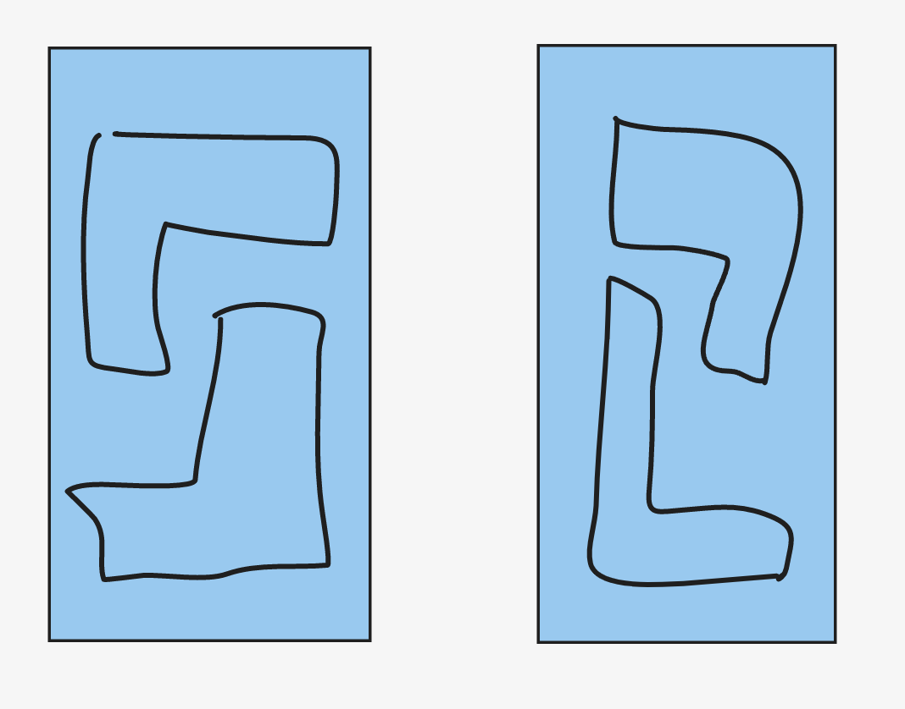

根据题意可得，我们在一个 3 * 2 的矩阵中摆放形状时，只有 2 种情况。



所以针对一个 `3 * n` 的矩阵，如果 `n` 为单数，我们可以输出 `0`

如果 `n` 为双数，针对每一个 `n`，我们都有 `dp[n - 2] * 2` 种方法来摆放。

```
#pragma GCC optimize ("O3")
#pragma GCC optimize("unroll-loops")
typedef long long LL;
#include <iostream> 
#include <sstream> 
#include <cstdio> 
#include <cmath> 
#include <cstring> 
#include <cctype> 
#include <string> 
#include <vector> 
#include <list> 
#include <set> 
#include <unordered_set>
#include <map> 
#include <unordered_map>
#include <queue> 
#include <stack> 
#include <algorithm> 
#include <functional> 

#define REP(i,n) for(int i=0;i<(n);i++)
#define all(cont) cont.begin(), cont.end()
#define EPS 1e-9
#define show(ans) cout << ans << endl;

template<class T> void chmax(T & a, const T & b) { a = max(a, b); } 
template<class T> void chmin(T & a, const T & b) { a = min(a, b); } 
typedef long long LL;
LL mod = 1e9 + 7;
 
using namespace std;

void solve() {
    int n;
    cin >> n;
    if (n % 2 != 0) {
        cout << 0 << endl;
        return;
    } 
    vector<LL> dp(n + 1);
    dp[0] = 0;
    dp[1] = 0;
    dp[2] = 2;
    for (int i = 4; i <= n; i++) {
        dp[i] = 2 * dp[i - 2];
    }
    show(dp[n]);
}


int main() {
    ios_base::sync_with_stdio(0);
    cin.tie(nullptr);
 
    // int q;
    // cin >> q;
    // while (q--) {
        solve();
    // }
}
```