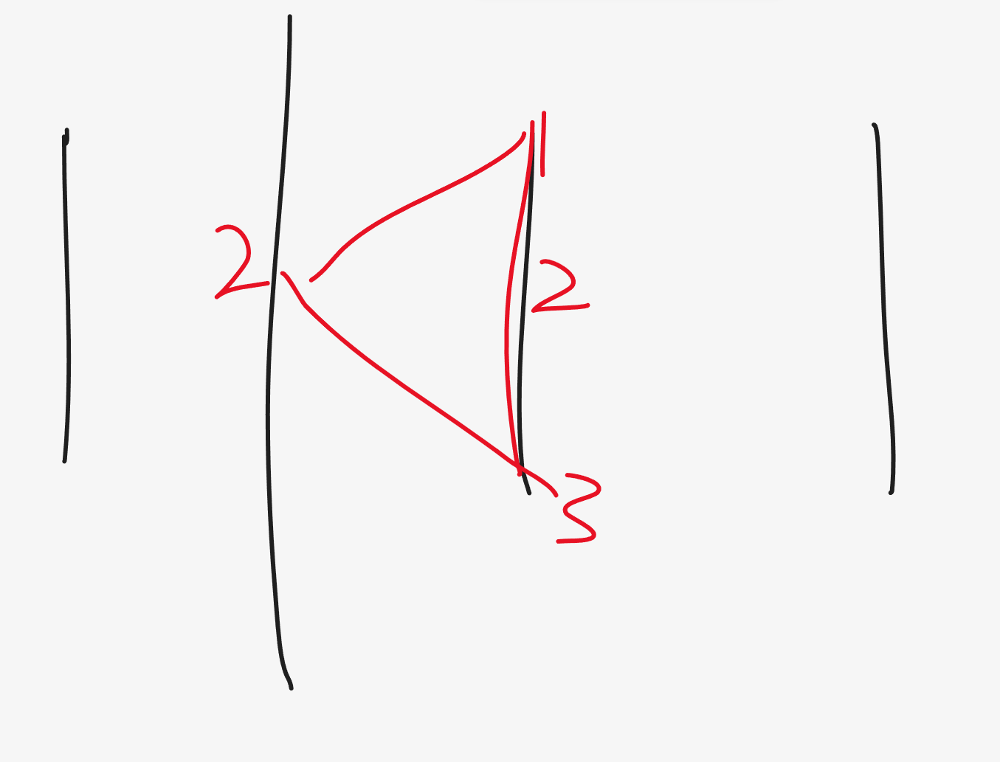
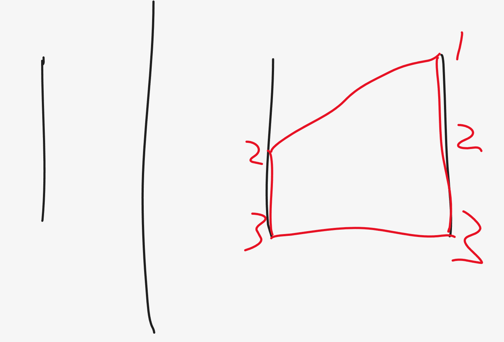
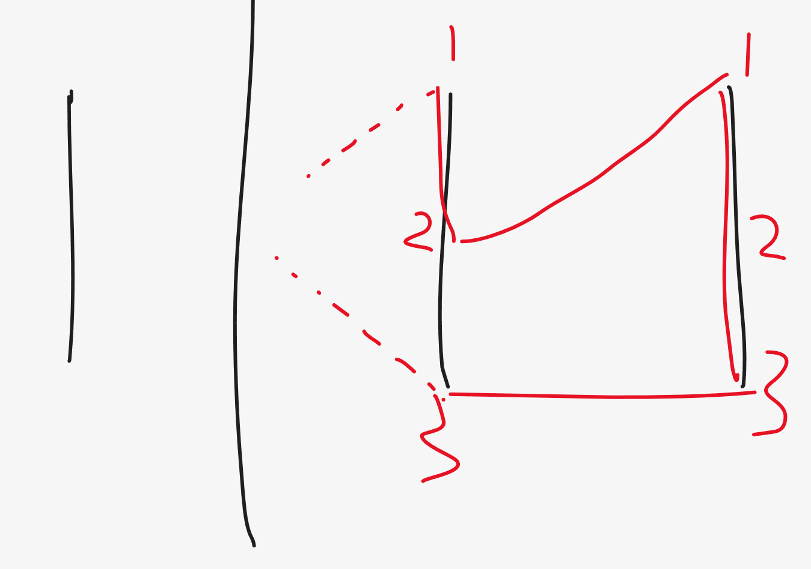

本题并不是一个图论问题，也不需要考虑欧拉回路，这是因为在给定的数据范围下，尝试建造图是一定会 MLE 的。

因为两个点之间的连接是确定的，我们可以考虑从左到右模拟一下连线的过程。


根据上方的例子，我们很快就能发现，当 `a[i]` 和 `b[i]` 相同的时候，在上例中`a[i] == b[i] == 2, i = 3`，`Simple Circle` 在这里被强制闭合。
所以这是我们必须结算 `Simple Circle` 的大小。

当 `i = 3` 时，我们会以这种方式建图



此时我们可以发现，我们经过的节点个数是

`c[i] + 2 - 1 + b[i] - a[i]`

- `c[i]` 是本身在这条线上拥有的节点数，值是 `3`
- `+ 2` 是我们延伸出来的两条线，分别连接两个左侧的节点
- `- 1` 我们后来发现其实因为 `a[i] == b[i]` 的原因，我们连接的其实是同一个节点，所以要减一
- `b[i] - a[i]` 连接的左侧两个节点之间的节点数，这里因为 `a[i] == b[i]` 的原因，很显然是 `0`

那么我们为什么不将这个公式化简呢？其实是因为这个公式具有普适性，因为我们需要考虑到所有可能的情况，也就是当 `a[i] != b[i]` 时的情况

当 `a[i] != b[i]` 时，我们有两种选择
- 闭合，再继续向后画线



我们可以发现，我们经过的节点个数是，`c[i] + 2 + b[i] - a[i] - 1`

1. `c[i]` 是本身在这条线上拥有的节点数，值是 `3`
2. `+ 2` 是我们延伸出来的两条线，分别连接两个左侧的节点
3. `b[i] - a[i] - 1` 我们需要计算两个左侧的节点 `3` 和 `2` 之间的节点数，很明显这两个点之间是直接连接的，之间没有节点
- 不闭合，直接向后画线



我们可以发现，我们经过的节点个数是，`previous + c[i] + 2 + (c[i] - b[i]) + (a[i] - 1)`
1. `c[i]` 是本身在这条线上拥有的节点数，值是 `3`
2. `+ 2` 是我们延伸出来的两条线，分别连接两个左侧的节点
3. `(c[i] - b[i]) + (a[i] - 1)` 是 `a[i]` 点到顶部，`b[i]` 到底部的之间的节点数总和

综上所述，我们只需要在这两种情况中取最大值即可，而第二种情况的前提条件是 `a[i] != b[i]`

```
#pragma GCC optimize ("O3")
#pragma GCC optimize("unroll-loops")
typedef long long LL;
#include <iostream> 
#include <sstream> 
#include <cstdio> 
#include <cmath> 
#include <cstring> 
#include <cctype> 
#include <string> 
#include <vector> 
#include <list> 
#include <set> 
#include <unordered_set>
#include <map> 
#include <unordered_map>
#include <queue> 
#include <stack> 
#include <algorithm> 
#include <functional> 

#define REP(i,n) for(int i=0;i<(n);i++)
#define all(cont) cont.begin(), cont.end()
#define EPS 1e-9

template<class T> void chmax(T & a, const T & b) { a = max(a, b); } 
template<class T> void chmin(T & a, const T & b) { a = min(a, b); } 
typedef long long LL;
LL mod = 1e9 + 7;
 
using namespace std;
 
// Code below
void solve() {
    int n;
    cin >> n;
    int c[n];
    int a[n];
    int b[n];
    LL dp[n];
    REP(i, n) cin >> c[i];   
    REP(i, n) cin >> a[i];
    REP(i, n) cin >> b[i];
    REP(i, n) dp[i] = 0;
    LL res = 0;
    for (int i = 1; i < n; i++) {
        if (a[i] > b[i]) swap(a[i], b[i]);
        dp[i] = c[i] + 2 + (b[i] - a[i] - 1);  // close
        if (a[i] != b[i]) {
            dp[i] = max(dp[i], dp[i - 1] + 2 + (c[i] - b[i]) + (a[i] - 1));  // continue
        }
        res = max(res, dp[i]);
    }
    cout << res << endl;
}


int main() {
    ios_base::sync_with_stdio(0);
    cin.tie(nullptr);
 
    int q;
    cin >> q;
    while (q--) {
        solve();
    }
}
```