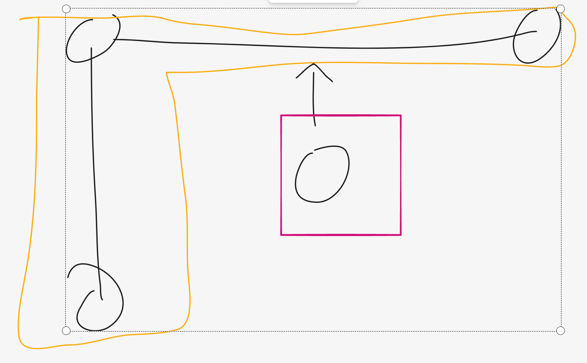

在本题中，玩家可以通过上下左右从一个雪块到达另外一个雪块，所以横纵坐标相同的 "雪块" 可以组成一个连通图，玩家可以自由滑行。

我们将所有横纵坐标相同的节点放入并查集中，最后并查集大小就是地图连通图的个数，如果需求是能够到达地图上的每个 "雪块"，
那么我们只需将所有的连通图连接起来即可。

将 N 个连通图连接起来需要 N - 1 条边，在本题中，就是在图中箭头指向的地方添加一个 "雪块"



最终答案就是并查集大小减一

```
#pragma GCC optimize ("O3")
#pragma GCC optimize("unroll-loops")
typedef long long LL;
#include <iostream> 
#include <sstream> 
#include <cstdio> 
#include <cmath> 
#include <cstring> 
#include <cctype> 
#include <string> 
#include <vector> 
#include <list> 
#include <set> 
#include <unordered_set>
#include <map> 
#include <unordered_map>
#include <queue> 
#include <stack> 
#include <algorithm> 
#include <functional> 

#define REP(i,n) for(int i=0;i<(n);i++)
#define all(cont) cont.begin(), cont.end()
#define EPS 1e-9

template<class T> void chmax(T & a, const T & b) { a = max(a, b); } 
template<class T> void chmin(T & a, const T & b) { a = min(a, b); } 
typedef long long LL;
LL mod = 1e9 + 7;
 
using namespace std;
 
// Code below
int Father[1000000 + 2000];
int findFather(int a) {
    if (a != Father[a]) {
        Father[a] = findFather(Father[a]);
    }
    return Father[a];
}

void Union(int a, int b) {
    if (findFather(a) == findFather(b)) return;
    a = Father[a];
    b = Father[b];
    if (a < b) {
        Father[b] = a;
    } else {
        Father[a] = b;
    }
}

typedef array<int, 2> A;
bool cmp1(A& a, A& b) {
    return a[0] < b[0];
}
bool cmp2(A& a, A& b) {
    return a[1] < b[1];
}


void solve() {
    int n;
    cin >> n;
    REP(i, 1002000) Father[i] = i; 
    vector<array<int, 2>> arr;
    REP(i, n) {
        int x;
        int y;
        cin >> x >> y;
        arr.push_back({x, y});
    }
    
    sort(arr.begin(), arr.end(), cmp1);
    REP(i, n - 1) {
        if (arr[i][0] == arr[i + 1][0]) {
             Union(arr[i][0] * 1000 + arr[i][1],
              arr[i + 1][0] * 1000 + arr[i + 1][1]);
        }
    }
    sort(arr.begin(), arr.end(), cmp2);
    REP(i, n - 1) {
        if (arr[i][1] == arr[i + 1][1]) {
             Union(arr[i][0] * 1000 + arr[i][1],
              arr[i + 1][0] * 1000 + arr[i + 1][1]);
        }
    }

    
    unordered_set<int> Set;
    REP(i, n) {
        Set.insert(findFather(arr[i][0] * 1000 + arr[i][1]));
    }
    cout << Set.size() - 1 << endl;
}


int main() {
    ios_base::sync_with_stdio(0);
    cin.tie(nullptr);
 
    // int q;
    // cin >> q;
    // while (q--) {
    solve();
    // }
}
```