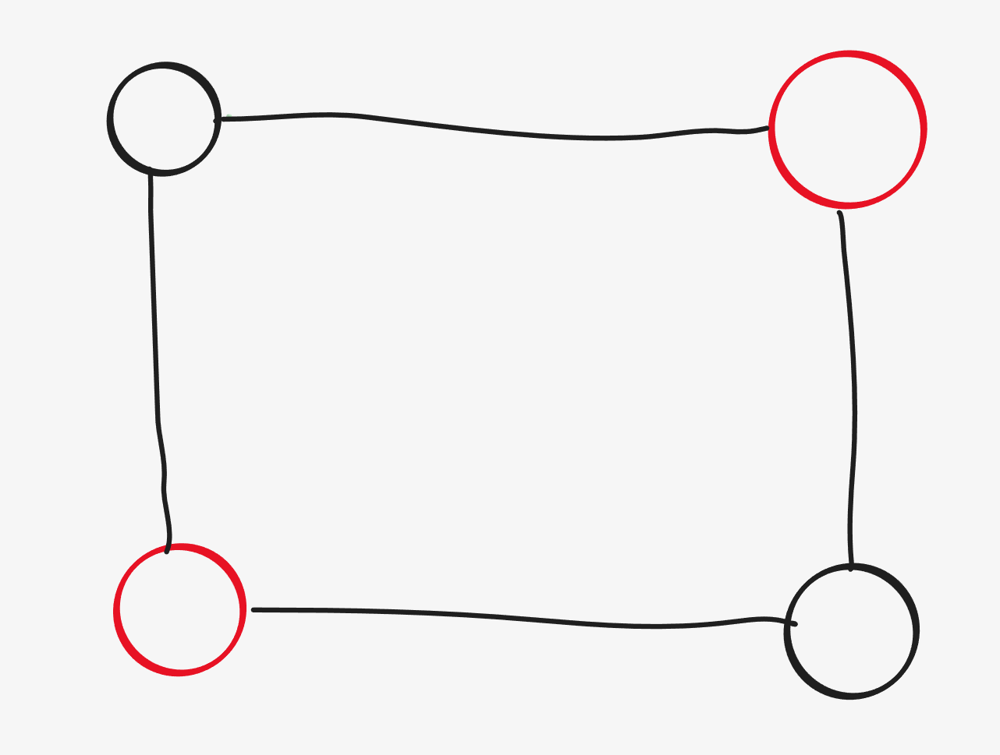
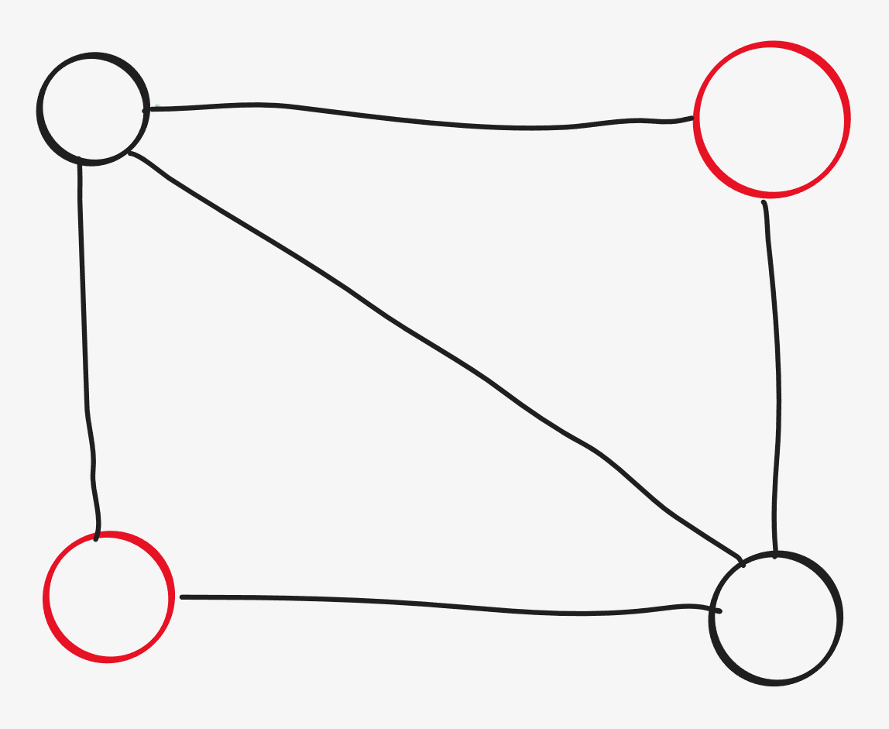

什么是二分图 (Bipartite)

如果能将一个图的节点集合分割成两个独立的子集 A 和 B ，并使图中的每一条边的两个节点一个来自 A 集合，一个来自 B 集合，就将这个图称为 二分图。

定义也许比较难理解，画图来表示，我们把黑色理解为上方定义的 A，红色理解为上方定义的 B

我们发现只存在红色连接黑色的情况，或者黑色连接红色的情况，并没有出现同色相连的情况，所以这是一个二分图



下方的图中，黑色连接黑色的情况出现了，如果我们把黑色改成红色，那么红色连接红色的情况实际上也会出现，，所以这不是一个二分图



再来介绍下什么是二分图的染色法判断

// TODO


```
typedef long long ll;
#include <iostream> 
#include <sstream> 
#include <cstdio> 
#include <cmath> 
#include <cstring> 
#include <cctype> 
#include <string> 
#include <vector> 
#include <list> 
#include <set> 
#include <unordered_set>
#include <map> 
#include <unordered_map>
#include <queue> 
#include <stack> 
#include <algorithm> 
#include <functional> 

#define REP(i, a, b) for (int i = (a); i < (b); i++)
#define all(cont) cont.begin(), cont.end()
#define EPS 1e-9
#define show(ans) cout << ans << endl

template<class T> void chmax(T & a, const T & b) { a = max(a, b); } 
template<class T> void chmin(T & a, const T & b) { a = min(a, b); } 
typedef long long ll;
ll mod = 1e9 + 7;
 
using namespace std;
void solve() {
    int n, m;
    cin >> n >> m;
    vector<vector<array<int, 2>>> g(n + 1);
    int colour[n + 1];
    REP (i, 0, n + 1) colour[i] = 0;
    REP (k, 0, m) {
        int i, j;
        string s;
        cin >> i >> j >> s;
        if (s[0] == 'i') {
            g[i].push_back({j, 1});
            g[j].push_back({i, 1});
        } else {
            g[i].push_back({j, 2});
            g[j].push_back({i, 2});
        }
    }
    
    int res = 0;
    REP (i, 1, n + 1) {
        if (colour[i]) continue;
        queue<array<int, 2>> q;
        q.push({i, 1});
        int c1 = 0;
        int c2 = 0;

        while (!q.empty()) {
            auto [n, c] = q.front();
            q.pop();

            if (colour[n]) continue;
            colour[n] = c;
            if (c == 1) c1++;
            if (c == 2) c2++;
            for (auto [conn, type] : g[n]) {
                if (colour[conn]) {
                    if (type == 1 && c == colour[conn]) {
                        show(-1);
                        return;
                    }
                    if (type == 2 && c != colour[conn]) {
                        show(-1);
                        return;
                    }
                }
                if (type == 1) {
                    q.push({conn, 3 - c});
                } else {
                    q.push({conn, c});
                }
            }
        }
        res += max(c1, c2);
    }
    show(res);
}

int main() {
    ios_base::sync_with_stdio(0);
    cin.tie(nullptr);
 
    int q;
    cin >> q;
    while (q--) {
        solve();
    }
}
```